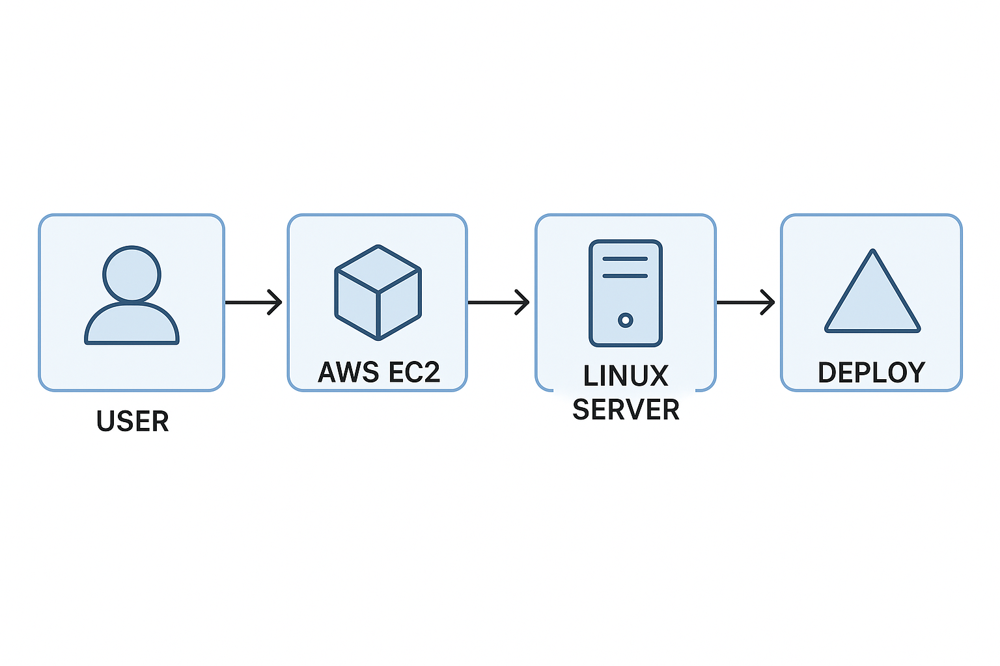
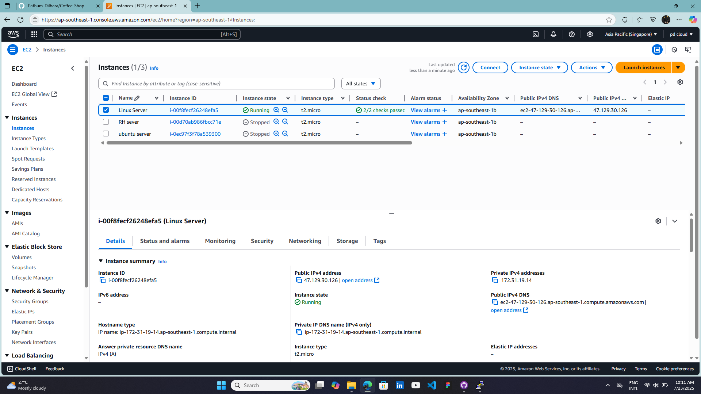
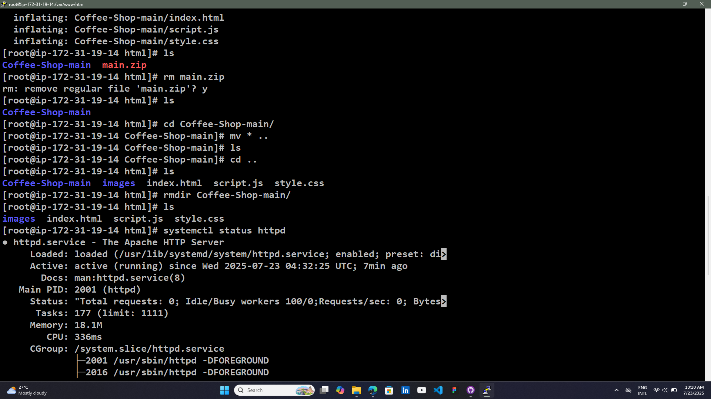

# Web Page Hosting in Linux Server

## 📋 Overview

This repository demonstrates a deployment process that runs through an AWS EC2 instance and deploys the application on a Linux server.

## 🛠 Pipeline Architecture
### 1. **User**
The developer or DevOps engineer who pushes code to a remote repository (e.g., GitHub).

### 2. **AWS EC2**
A virtual machine instance hosted on Amazon Web Services. It acts as the build and deployment executor.

### 3. **Linux Server**
The environment (within EC2) where the deployment scripts are run. 

### 4. **Deploy**
The final deployment step—this could be restarting a service, pulling the latest code.

## 📦 Tools & Technologies

- AWS EC2
- Linux
- Git & GitHub
- Shell Scripting

## 📁 Project

AWS EC2 server :

CLI (Linux) :

Web Hosting :

